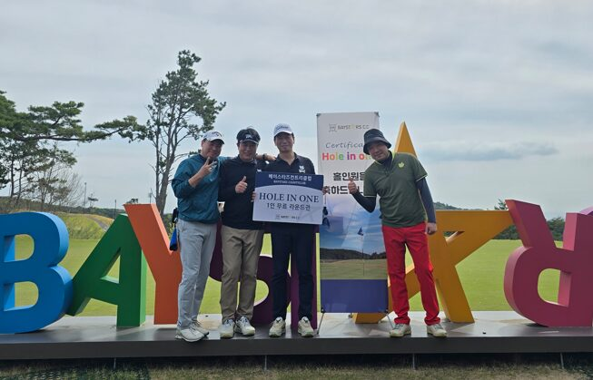

# 홈페이지 진단 및 개선 제안

- 진단일: 2026-08-10
- 대상: `index.html`, `main.js`(2,258줄), `style.css`(3,763줄), `functions/api/*`
- 관점: **방문자가 실제로 보는 홈페이지** — 콘텐츠/정보구조, UX, 접근성, 성능, SEO, 보안, 유지보수성
- 방법: 전체 소스 정독 + `npm start` 로컬 서버 실행 검증 + 자산/의존성 계량
- 한계: 이 실행 환경은 외부 네트워크가 차단되어 **배포된 실제 URL과 Lighthouse는 재측정하지 못했습니다.** 배포 환경 관련 항목은 코드 근거로만 판단했고, 인프라·마이그레이션 이슈는 [`REPLIT_MIGRATION_AUDIT.md`](./REPLIT_MIGRATION_AUDIT.md)와 중복되지 않도록 참조로 처리했습니다.

---

## 0. 요약

디자인 완성도와 기능 범위는 이미 좋습니다. 딥그린·아이보리 팔레트, OKLCH 토큰, `@layer` 구조, 반응형, 이미지 파생본 체계는 개인 동호회 사이트 수준을 넘습니다.

문제는 **"만들어진 것"이 아니라 "지금 상태"**에 있습니다. 가장 큰 문제 세 가지는 기술이 아니라 콘텐츠·신뢰·견고성입니다.

1. **일정 섹션에 다가올 일정이 하나도 없습니다.** 오늘(8/10) 기준으로 "일정"이라는 이름의 섹션 전체가 이미 끝난 7월 4일 대회를 보여줍니다. 방문자가 홈페이지에 오는 1순위 이유("다음에 언제 모이지?")가 충족되지 않습니다.
2. **회원 이름이 화면마다 다르게 표기됩니다.** 회원명부는 `하선재`, 대회 참가자 명단 3곳은 `허선재`입니다. 같은 페이지 안에서 실명이 어긋나 있습니다.
3. **JavaScript가 실패하면 페이지가 완전한 백지입니다.** 본문 전체가 JS 템플릿 안에 있고 `<noscript>` 대체도 없습니다. 카카오톡·검색엔진 미리보기에도 본문이 잡히지 않습니다.

| 등급 | 개수 | 성격 |
| --- | --- | --- |
| P0 — 즉시 | 5 | 방문자가 바로 체감하거나, 운영 리스크가 있는 문제 |
| P1 — 2주 내 | 12 | 접근성·성능·중복 콘텐츠 등 품질을 깎는 문제 |
| P2 — 여유 있을 때 | 9 | 유지보수성과 확장성 문제 |

---

## 1. P0 — 즉시 조치

### H-01. 일정 섹션에 다가올 일정이 없음 (콘텐츠)

**근거**

| 위치 | 현재 문구 |
| --- | --- |
| `main.js:565` | `<h2>Screen Event Board</h2>` |
| `main.js:581` | `<p class="event-state">참가 완료</p>` |
| `main.js:583` | `제8회 석노협 스크린골프대회 **기록**` |
| `main.js:1591` | `제8회 석노협 스크린골프대회 사진을 확인하세요.` |
| `main.js:324` | 하단 공지 = `New Archive` (지난 사진 안내) |

**문제** — `#schedule` 섹션 전체, 하단 고정 공지, 히어로 메타까지 전부 **끝난 행사**를 가리킵니다. 소개 섹션의 `다음 모임 보기` 링크(`main.js:499`)를 누르면 5주 전에 끝난 대회 상세가 나옵니다.

**영향** — 회원이 홈페이지를 다시 방문할 이유가 사라집니다. 지금 구조에서는 "지난 일을 잘 정리해둔 아카이브 사이트"이지, "모임을 운영하는 사이트"가 아닙니다.

**개선**

- 일정 섹션을 **`다가오는 일정` / `지난 일정`** 두 상태로 나누고, 데이터에 상태 필드를 둡니다.
  ```js
  const events = [
    { id: "2026-09-regular", state: "upcoming", date: "2026-09-XX", title: "3분기 정기전", ... },
    { id: "2026-07-seoknohyup", state: "past", date: "2026-07-04", ... }
  ];
  const upcoming = events.filter(e => e.state === "upcoming" && new Date(e.date) >= new Date());
  ```
- 확정된 다음 일정이 없다면 그 사실 자체를 보여줍니다. 빈 화면보다 낫습니다.
  > **다음 모임 준비 중** · 3분기 정기전 일정은 확정되는 대로 이 자리에 안내합니다. (총무 정무근)
- 하단 고정 공지는 "지난 사진 홍보"가 아니라 **다음 일정 안내** 용도로 되돌립니다. 지난 사진 홍보는 아카이브 섹션 하나로 충분합니다.

---

### H-02. 회원 실명 표기 불일치

**근거**

| 파일:라인 | 표기 |
| --- | --- |
| `main.js:19` | `{ handle: "장금이에이스", name: "**하**선재" }` |
| `main.js:179` | `A팀(301호) 김효준, 서무환, 정무근, **허**선재` |
| `main.js:604` | `A팀 김효준, 서무환, 정무근, **허**선재` |
| `main.js:872` | `A팀(301호): 김효준, 서무환, 정무근, **허**선재` |
| `main.js:203, 208` | 6월 행사 참석자 = `**하**선재` |

**문제** — 같은 사람이 `하선재`와 `허선재`로 갈립니다. 실명이 틀리는 것은 동호회 사이트에서 가장 민감한 종류의 오류입니다.

**개선**

1. 어느 쪽이 맞는지 확인 후 통일합니다.
2. 근본 대책 — 참가자 명단을 문자열로 다시 적지 말고 **회원 ID로 참조**합니다.
   ```js
   // 지금: "참가: ... 정무근, 허선재 / B팀 ..."  ← 오타가 나면 아무도 모름
   // 개선: teams: { A: ["김효준","서무환","정무근","하선재"], B: [...] }
   //       → 렌더링 시 members 배열에 없는 이름이면 콘솔 경고
   ```
   이렇게 하면 오타가 즉시 드러납니다. 지금은 같은 정보가 4곳에 손으로 복사돼 있어 한 곳만 고치면 나머지가 남습니다(→ H-11).

---

### H-03. JS 없이는 완전 백지 · 검색/공유 미리보기에 본문 없음

**근거** — `index.html:31-41`의 `<main>` 안은 전부 빈 커스텀 엘리먼트입니다.
```html
<main id="top">
  <kolon-hero></kolon-hero>
  <kolon-intro id="features"></kolon-intro>
  ...
</main>
```
`<noscript>` 없음, `main.js` 실패 시 대체 경로 없음. `document.documentElement.classList.add("js")`(`main.js:1016`)로 `js` 클래스를 붙이지만 **CSS 어디에서도 이 클래스를 쓰지 않습니다**(죽은 코드).

**문제**

- `main.js` 로드 실패(CDN 차단, 캐시 깨짐, 문법 오류 1개) → 화면에 아무것도 남지 않습니다. 헤더도 푸터도 없습니다.
- 검색엔진과 카카오톡/슬랙 링크 미리보기는 OG 태그만 읽습니다. 회원 21명, 지난 라운드 8건, 방명록 어떤 텍스트도 색인되지 않습니다.
- `initPage()`(`main.js:2242`)가 13개 init을 **try/catch 없이 순차 호출**해서, 앞쪽 하나가 던지면 뒤쪽 전부가 죽습니다.

**개선**

1. **최소 대책(30분)** — `<noscript>` 안내 + init 개별 격리.
   ```js
   const initPage = () => {
     [initHeader, initSmoothScroll, /* ... */].forEach((fn) => {
       try { fn(); } catch (error) { console.error(`[init] ${fn.name} 실패`, error); }
     });
   };
   ```
2. **권장(반나절)** — 히어로 제목, 소개 문단, 다음 일정, 연락처처럼 **바뀌지 않는 핵심 텍스트는 `index.html`에 실제 HTML로** 두고, 커스텀 엘리먼트는 그 위에 얹는 방식(progressive enhancement)으로 바꿉니다. LCP도 같이 개선됩니다.
3. 빌드를 하나 도입할 수 있다면 정적 프리렌더(빌드 시 `main.js` 템플릿을 HTML로 굽기)가 가장 확실합니다.

---

### H-04. 관리자 진입 버튼이 공개 푸터에 노출됨

**근거**

- `main.js:1666-1675` — 모든 방문자의 푸터에 `관리자` 버튼을 추가합니다.
- `functions/api/messages.js:44-52`, `archives.js:46-50` — `ADMIN_TOKEN` 문자열 단순 비교. **실패 횟수 제한 없음**, 타이밍 세이프 비교 아님.
- 두 API 모두 `access-control-allow-origin: *` (`messages.js:2`, `archives.js:2`) — 어느 사이트에서든 관리자 엔드포인트를 호출할 수 있습니다.

**문제** — 공개 페이지에 "여기가 관리자 입구입니다"라고 표시해 두고, 그 뒤에는 시도 횟수 제한이 없는 단일 비밀번호가 있습니다. 자동화된 대입 시도를 막을 장치가 서버·클라이언트 어디에도 없습니다.

**개선**

1. 푸터 버튼을 **제거**하고, `#admin` 해시나 별도 경로에서만 패널을 만들게 합니다.
   ```js
   if (window.location.hash !== "#admin") return; // initMessageAdmin 최상단
   ```
2. 서버에서 관리자 인증 실패를 **IP 해시 기준으로 카운트**합니다. 이미 `hashValue()`와 `checkRateLimit()` 패턴이 있으니 재사용하면 됩니다(예: 10분 5회 초과 시 429).
3. 비교를 상수 시간으로 바꿉니다.
   ```js
   const timingSafeEqual = (a, b) => {
     if (a.length !== b.length) return false;
     let diff = 0;
     for (let i = 0; i < a.length; i += 1) diff |= a.charCodeAt(i) ^ b.charCodeAt(i);
     return diff === 0;
   };
   ```
4. 관리자 메서드(PATCH/DELETE)는 CORS 허용 오리진을 운영 도메인으로 좁힙니다.

---

### H-05. 저장소 파일 전체 공개 · 미리보기 서버 크래시 (기존 감사 항목, **미해결 확인**)

이번에 로컬에서 다시 재현했습니다.

```
firebase-debug.log   200      wrangler.toml   200      .replit        200
AGENTS.md            200      PROJECT_LOG.md  200      migrations/…   200
GET /%   →  서버 프로세스 즉시 종료 (URIError, scripts/serve.js:37)
```

`decodeURIComponent()`가 `try/catch` 없이 호출돼 잘못 인코딩된 URL 한 번에 서버가 죽습니다. 두 항목 모두 [`REPLIT_MIGRATION_AUDIT.md`](./REPLIT_MIGRATION_AUDIT.md) P0-1/P0-3에 이미 기록돼 있으나 **코드에는 아직 반영되지 않았습니다.** 루트의 `home1.png`, `home2.png`, `image.png`, `mobile1.png`, `notice.png`(약 880KB)와 `images/20260704 MOV.mov`(1.2MB)도 사용되지 않은 채 배포됩니다.

---

## 2. P1 — 접근성

### H-06. 라이트박스 키보드 조작이 댓글 입력을 방해함

**근거** — `main.js:1316-1320`
```js
document.addEventListener("keydown", (event) => {
  if (!lightbox?.classList.contains("open")) return;
  if (event.key === "ArrowLeft") render(index - 1);
  if (event.key === "ArrowRight") render(index + 1);
});
```
라이트박스 안에는 **댓글 입력 폼이 들어 있습니다**(`main.js:939`).

**문제** — 댓글을 쓰다가 오타를 고치려고 ←/→ 를 누르면 커서가 아니라 **사진이 넘어갑니다.** 입력 중이던 내용은 남지만 보고 있던 사진이 바뀌어, 어떤 사진에 대한 댓글인지 알 수 없게 됩니다.

**개선**
```js
const isTyping = (target) =>
  target instanceof HTMLElement &&
  (target.matches("input, textarea, select") || target.isContentEditable);

document.addEventListener("keydown", (event) => {
  if (!lightbox?.classList.contains("open")) return;
  if (isTyping(event.target)) return;
  ...
});
```

### H-07. 라이트박스를 닫으면 포커스가 사라짐

**근거** — `initLightbox.open()`(`main.js:1281-1302`)은 `lastFocusedElement`를 기록하지 않습니다. 닫기는 `initModals.closeModal`이 처리하는데, 거기서 복원하는 `lastFocusedElement`(`main.js:1201`)는 **모달로 연 적이 있을 때만** 채워집니다.

**문제** — 키보드/스크린리더 사용자가 아카이브 카드에서 사진을 열고 닫으면 포커스가 `<body>`로 돌아가, 다시 Tab을 수십 번 눌러야 원래 위치로 갑니다.

**개선** — 라이트박스 열기/닫기를 `initModals`의 `openModal`/`closeModal`로 일원화하거나, 최소한 `open()`에서 `lastFocused = document.activeElement`를 저장하고 닫을 때 복원합니다.

### H-08. 모달에 포커스 트랩이 없고 배경이 비활성화되지 않음

`openModal`(`main.js:1215-1223`)은 첫 요소에 포커스만 줍니다. Tab을 계속 누르면 **모달 뒤의 페이지 전체**를 순회합니다. 배경에 `inert`도 적용되지 않습니다.

```js
const focusables = modal.querySelectorAll('a[href], button:not([disabled]), input, textarea, select, [tabindex]:not([tabindex="-1"])');
// Tab / Shift+Tab 을 첫·마지막 요소 사이로 순환시키고
document.querySelector("main")?.toggleAttribute("inert", true); // 열 때
```

### H-09. 히어로 자동 슬라이드를 멈출 수 없음 (WCAG 2.2.2 위반)

**근거** — `main.js:1186` `setInterval(..., 6400)`. 정지/일시정지 컨트롤이 없고, `prefers-reduced-motion`일 때만 자동 재생을 끕니다.

**문제** — 5초 이상 자동으로 움직이는 콘텐츠에는 정지 수단이 있어야 합니다(WCAG 2.2.2 Pause, Stop, Hide). 마우스를 올려도 멈추지 않아, 캡션을 읽는 중에 사진이 넘어갑니다.

**개선**
- 일시정지 버튼 추가, 그리고 `mouseenter`/`focusin`에 `clearInterval`, `mouseleave`/`focusout`에 재시작.
- 캡션 영역에 `aria-live="polite"`, 슬라이드 컨테이너에 `aria-roledescription="carousel"`.

### H-10. 건너뛰기 링크 없음 · 하단 공지가 불필요하게 읽힘

- **skip link 부재** — `index.html`/`main.js` 전체에 없습니다. 키보드 사용자는 매 페이지 진입마다 헤더 내비 5개를 지나야 본문에 닿습니다.
  ```html
  <a class="skip-link" href="#top">본문으로 건너뛰기</a>
  ```
- **`aria-live="polite"` 오용** — `main.js:952`의 하단 공지는 정적 홍보 문구인데 라이브 리전으로 선언돼, 스크린리더가 페이지 로드 직후 공지 전문을 읽습니다. `aria-live`를 제거하고 `role="complementary"`로 충분합니다.
- **영문 kicker의 언어 표시** — `Screen Event Board`, `Club Members`, `Round Comments` 등이 `lang="ko"` 문서 안에 있어 한국어 음성으로 잘못 읽힙니다. `<p class="section-kicker" lang="en">` 한 줄이면 해결됩니다.

---

## 3. P1 — 콘텐츠 / UX

### H-11. 7월 대회 정보가 한 페이지에 8~11번 반복됨

**근거** — `main.js`에서 `석노협` 11회, `삼산한국골프점` 8회 등장. 실제 노출 지점:

| # | 위치 | 라인 |
| --- | --- | --- |
| 1 | 히어로 메타 스트립 `Latest` | 452 |
| 2 | 일정 섹션 헤딩 문단 | 567 |
| 3 | `next-event` 카드 | 583 |
| 4 | `event-detail-panel` (일시/장소/방식/선수) | 588-606 |
| 5-7 | `schedule-notes` 3개 카드 | 620-634 |
| 8 | `rsvpModal` 본문 | 864-875 |
| 9 | `locationModal` 본문 | 902-909 |
| 10 | JS로 주입되는 `next-round-brief` | 1591-1596 |
| 11 | 아카이브 `archives[0]` + 하단 공지 | 164-194, 323-328 |

**문제** — 같은 정보를 11번 읽게 만들고, 고칠 때 11곳을 손대야 합니다. H-02의 이름 오타가 정확히 이 구조 때문에 3곳에 남았습니다.

**개선** — 행사 정보를 **단일 객체 하나**로 두고 각 UI가 그 객체를 참조하게 합니다.
```js
const featuredEvent = {
  id: "2026-07-seoknohyup",
  title: "제8회 석노협 스크린골프대회",
  when: "2026-07-04T08:00+09:00",
  place: "골프존파크 삼산한국골프점",
  teams: { A: [...], B: [...] },
  rules: ["투비전 NX", "블루 티", "컨시드 1.5m", "멀리건 없음"]
};
```
그리고 화면에서는 **3곳으로 줄입니다**: 일정 카드 1개, 상세 모달 1개, 아카이브 항목 1개. 나머지는 삭제합니다.

### H-12. 히어로 CTA 5개 중 3개가 같은 곳으로 감

**근거** — `main.js:456-459` + `1561-1576`
```
[대회 사진 보기] → #archive
[행사 사진 보기] → #archive     ← 바로 옆 버튼과 목적지 동일
[방명록 남기기] → #guestbook
빠른 이동 패널: 다음 모임(#schedule) / 지난 사진(#archive) / 한마디(#guestbook)
```

**문제** — 첫 화면에 링크가 6개인데 그중 3개가 `#archive`입니다. 나란히 붙은 두 버튼의 목적지가 같아 "무엇이 다르지?"라고 멈추게 만듭니다.

**개선** — 첫 화면 CTA는 **최대 2개**로. `주 CTA = 다음 모임 보기(#schedule)`, `보조 CTA = 지난 라운드 보기(#archive)`. 빠른 이동 패널은 유지하되 버튼 행과 역할이 겹치지 않게 정리합니다.

### H-13. 브라우저 뒤로 가기와 섹션 링크 공유가 깨짐

**근거** — `main.js:1080-1091`
```js
event.preventDefault();
target.scrollIntoView({ behavior: "smooth", block: "start" });
```
URL 해시를 갱신하지 않습니다. 게다가 `style.css:72`에 이미 `html { scroll-behavior: smooth }`가 있어 **이 JS는 없어도 부드럽게 스크롤됩니다.**

**문제** — 내비게이션을 눌러도 주소가 그대로여서 "회원 명단 링크 좀 보내줘" 같은 공유가 불가능하고, 뒤로 가기가 동작하지 않습니다.

**개선** — `initSmoothScroll` 전체를 **삭제**합니다. CSS만으로 동일한 동작을 얻고, 해시·뒤로가기·딥링크가 모두 정상화됩니다. (섹션 상단 여백은 `scroll-margin-top`(`style.css:123`)이 이미 처리 중입니다.)

### H-14. 회원 검색에 결과 없음 안내가 없음 · 닉네임 없는 회원은 이름이 두 번 표시됨

- `initMemberSearch`(`main.js:1134-1154`)는 매칭 없는 카드를 `display:none` 처리만 합니다. 오타를 치면 **회원 목록이 통째로 사라진 빈 화면**이 되고 아무 설명이 없습니다. → `표시할 회원이 없습니다` 안내와 `검색 결과 N명` 카운트 추가.
- 닉네임이 없는 신입회원 3명(`main.js:20-22`)은 `handle`에 이름을 그대로 넣어, 카드에 `서승규` / `**서승규** · 침착한 코스 리딩`으로 이름이 두 번 나옵니다. → `handle` 없으면 이름 한 줄만 렌더링하도록 분기.
- 검색은 `card.textContent`(`main.js:1142`)를 그대로 비교해 초성 검색이 안 되고 `정회원`처럼 역할 라벨에도 걸립니다. 검색 대상 필드를 `data-search` 속성에 명시하는 편이 예측 가능합니다.

---

## 4. P1 — 성능

### H-15. 사진에 크기 정보와 반응형 소스가 없음

**근거** — `main.js`의 `` 9개 중 `width`/`height`가 있는 것은 44px 동물 이모지 하나뿐입니다. `srcset`/`<picture>`는 `index.html`과 `main.js` 통틀어 **0개**입니다.

**문제**

- 히어로 이미지(LCP 요소)에 크기가 없어 로드 전후로 레이아웃이 밀립니다(CLS).
- `-display` 파생본은 긴 변 1800px입니다. 390px 폭 휴대폰도 **1800px 원본을 그대로 내려받습니다.** 아카이브까지 스크롤하면 약 2.5MB, 7월 갤러리 11장을 넘기면 추가 2.7MB입니다.

**개선**
```html

```
`scripts/optimize-images.sh`에 800px 단계와 **WebP/AVIF** 출력을 추가하면 같은 화질에서 30~50% 더 줄일 수 있습니다.

### H-16. 폰트 4종이 첫 화면을 막음

**근거** — `index.html:24`에서 `Cormorant Garamond` + `Inter` + `Noto Sans KR`(4 weight) + `Noto Serif KR`(2 weight)을 **렌더 블로킹 `<link rel="stylesheet">`**로 불러옵니다. 한글 폰트 2종은 서브셋이어도 용량이 큽니다.

**개선**

1. 실제 사용 weight를 감사해 줄입니다(`Noto Sans KR` 400/700 정도면 충분한지 확인).
2. `Noto Serif KR`과 `Cormorant Garamond`는 역할이 겹칩니다(`--font-serif` 폴백 체인, `style.css:53`). 하나로 통일하면 요청 한 종류가 통째로 사라집니다.
3. 스타일시트를 비차단으로 전환하고 시스템 폰트로 먼저 그립니다.
   ```html
   <link rel="preload" as="style" href="…" onload="this.rel='stylesheet'">
   ```

### H-17. 첫 로드에 크로스오리진 API 요청 약 10건

**근거**

| 호출 | 위치 | 건수 |
| --- | --- | --- |
| 방명록 목록 | `main.js:1543` | 1 |
| 회원 업로드 목록 | `main.js:2067` | 1 |
| 아카이브별 댓글 수 | `main.js:1633-1650` | **8** (아카이브 8건 각각) |

댓글 **개수**만 필요한데 `/messages?type=archive_comment&archiveId=…`로 **댓글 본문 전체**를 8번 받아 `.length`를 셉니다(`main.js:1644`). GitHub Pages에서는 전부 `kolongolf.pages.dev`로 나가는 교차 출처 요청입니다.

**개선**

- 서버에 집계 엔드포인트를 하나 추가합니다: `GET /api/messages/counts?type=archive_comment` → `{ "2026-07-seoknohyup": 3, ... }`. 8건이 1건이 됩니다.
- 댓글 수 표시는 아카이브가 화면에 들어올 때(IntersectionObserver) 지연 로드합니다.
- 실패 시 `댓글 준비 중` 칩이 8개 모두 뜨는데(`main.js:1647`), 차라리 칩을 숨기는 편이 낫습니다.

### H-18. 스크롤할 때마다 강제 리플로우 발생

**근거** — `main.js:1123-1126`
```js
const update = () => {
  const maxScroll = document.documentElement.scrollHeight - window.innerHeight; // 매 스크롤마다 레이아웃 강제 계산
  ...
};
window.addEventListener("scroll", update, { passive: true });
```
스크롤 리스너가 2개(`initScrollProgress`, `syncHeaderState`), resize 리스너가 3개 있고 모두 스로틀이 없습니다.

**개선** — `scrollHeight`는 resize/DOM 변경 때만 다시 재고, 업데이트는 `requestAnimationFrame`으로 묶습니다.
```js
let maxScroll = 0, ticking = false;
const measure = () => { maxScroll = document.documentElement.scrollHeight - window.innerHeight; };
const onScroll = () => {
  if (ticking) return;
  ticking = true;
  requestAnimationFrame(() => { /* progress + header 동시 갱신 */ ticking = false; });
};
```

### H-19. 회원 아바타 21개가 외부 CDN에 의존

**근거** — `main.js:47` `https://cdn.jsdelivr.net/npm/@twemoji/svg@15.0.0`, `main.js:83`에서 회원당 1개씩 총 21개 요청. `index.html`의 `preconnect`는 Google Fonts 전용이라 **jsDelivr에는 preconnect가 없습니다.**

**문제** — 코오롱 사내망처럼 외부 CDN이 차단된 환경에서는 회원 카드의 아이콘이 전부 깨집니다(`alt=""`, `aria-hidden` 이라 대체 표시도 없습니다). 사내 동호회 사이트라는 성격상 현실적인 시나리오입니다.

**개선** — 사용하는 21개 이모지를 `images/emoji/`에 받아 **자체 호스팅**하거나, 하나의 SVG 스프라이트로 합쳐 `<use>` 참조로 바꿉니다(이 방식은 이미 `PROJECT_LOG`에 한 번 적용한 이력이 있습니다). 요청 21건 → 1건으로도 줄어듭니다.

---

## 5. P1 — SEO / 공유 / 개인정보

### H-20. 검색·공유 메타가 최소 수준

`index.html`에 없는 것:

| 항목 | 영향 |
| --- | --- |
| `<link rel="canonical">` | `github.io`와 `pages.dev` 두 도메인에 동일 콘텐츠 → 중복 문서 |
| `robots.txt`, `sitemap.xml` | 색인 유도 수단 없음 |
| JSON-LD 구조화 데이터 | 검색 결과에 동호회/행사 정보가 풍부하게 노출되지 않음 |
| `og:image:width/height` | 공유 카드 렌더 지연 |

**개선** — `SportsClub` + `Event` 스키마를 넣으면 다음 일정이 검색 결과에 직접 노출될 수 있습니다.
```html
<script type="application/ld+json">
{ "@context":"https://schema.org", "@type":"SportsClub",
  "name":"코오롱 스크린 골프 동호회", "sport":"Golf",
  "url":"https://moogun-jeong.github.io/kolongolf/",
  "event": { "@type":"Event", "name":"3분기 정기전", "startDate":"2026-09-XX" } }
</script>
```
단, **H-03(본문이 HTML에 없음)을 먼저 해결하지 않으면 메타 태그만으로는 효과가 제한적입니다.**

### H-21. 실명 21명 + 사내 이메일이 평문 노출

**근거** — `main.js:10`, `main.js:15`의 `pleaselove@kolon.com` / `moogunjeong@kolon.com`이 가입 모달(`main.js:891-892`)과 푸터 `<address>`(`main.js:993`)에 그대로 렌더링됩니다. 여기에 회원 21명 실명·직책·회사가 공개 URL에 붙습니다.

**문제** — 이메일 수집 봇의 표준 수확 대상이고, 회사명 + 실명 조합은 개인정보에 해당합니다. 회원 동의 여부가 문서에 남아 있지 않습니다.

**개선**

- 이메일은 **연락 폼이나 마스킹**으로 대체합니다(`moogunjeong [at] kolon.com` 정도라도 즉효).
- 회원명부를 **닉네임 기본 노출**로 바꾸고 실명은 선택 항목으로 둡니다. 이미 닉네임 체계가 있으니 표시 우선순위만 뒤집으면 됩니다.
- 공개 범위에 대한 회원 동의를 한 번 받고 그 사실을 문서에 남깁니다. (기존 감사 P1-8과 동일 취지)

### H-22. 회원 사진 업로드 API가 무인증 · 봇 검증 없음

**근거** — `functions/api/archives.js`의 `onRequestPost`는 `validateTurnstile`을 **호출하지 않습니다**(메시지 API에만 있음). 방어는 IP당 10분 2건 제한(`archives.js:95`) 하나뿐이고, 한 건당 base64 이미지 최대 1.2MB가 D1에 바로 저장됩니다. `index.html:17`의 `cf-turnstile-sitekey`는 **빈 값**이라 방명록 쪽 위젯도 실제로는 표시되지 않습니다.

**개선** — 업로드에도 Turnstile을 적용하고 sitekey를 채웁니다. 사진 본문은 D1 텍스트 컬럼이 아니라 R2에 두고 키만 저장하는 편이 맞습니다(기존 감사 P1-3과 동일). 최소한 전체 저장 용량 상한과 오래된 `pending` 자동 정리는 지금 넣어둘 만합니다.

---

## 6. P2 — 유지보수성

| ID | 항목 | 근거 | 개선 |
| --- | --- | --- | --- |
| H-23 | **데이터와 화면이 한 파일에** | 회원·아카이브·일정이 전부 `main.js` 상단 상수 | `data/members.json`, `data/archives.json`으로 분리. 콘텐츠 수정에 코드 리뷰가 필요 없어짐 |
| H-24 | **컴포넌트 렌더 후 DOM을 다시 기움** | `initMemberExperienceEnhancements`(`main.js:1546-1665`)가 히어로·일정·아카이브에 HTML을 사후 주입 | 해당 마크업을 각 컴포넌트 템플릿으로 되돌리기. 지금 구조는 "패치 위의 패치"라 다음 수정 때마다 위험이 커집니다 |
| H-25 | **주입된 `data-reveal`이 애니메이션되지 않음** | `initReveal`(`main.js:1093`)이 먼저 수집을 끝낸 뒤 H-24가 요소를 추가 | H-24 해결 시 자동 해소. 유지한다면 `initReveal`을 나중에 호출하거나 MutationObserver 사용 |
| H-26 | **중복 유틸 함수** | `escapeText` 2벌(`1749`, `1897`), `formatDate` 2벌(`1327`, `1756`), API base 계산 3벌 | 공통 모듈로 추출 |
| H-27 | **`initPage` 에러 격리 없음** | `main.js:2242-2256` | H-03의 try/catch 패턴 적용 |
| H-28 | **동물 아이콘이 정확히 21개** | `memberAnimals` 21개 ÷ 회원 21명, `index % length`(`main.js:74`) | 22번째 회원부터 사슴이 중복됩니다. 회원 수 초과 시 콘솔 경고 또는 색상 변주 추가 |
| H-29 | **회원 수 하드코딩** | `main.js:454` `<strong>Members</strong>21명` | `${members.length}명` |
| H-30 | **죽은 CSS** | `.member-pulse-card`, `.icon-calendar`, `.icon-heart`, `.icon-members`가 마크업에 없음. `.archive-card-comment`는 규칙이 4번 중복 정의 | 정리. `style.css` 3,763줄 중 상당량이 누적물입니다 |
| H-31 | **푸터를 JS로 body에 append** | `main.js:1015` | `index.html`에 다른 컴포넌트와 동일하게 배치. 현재는 모달·하단공지 뒤에 붙어 탭 순서가 어색합니다 |

---

## 7. 실행 로드맵

### 1단계 — 반나절 (신뢰도 회복)

- [ ] H-02 이름 표기 통일 (`하선재`/`허선재` 확인 후 1곳으로 참조화)
- [ ] H-01 일정 섹션에 "다음 모임" 상태 만들기 — 미정이면 미정이라고 표시
- [ ] H-04 푸터 관리자 버튼 제거 → `#admin` 게이트
- [ ] H-05 `serve.js` `decodeURIComponent` try/catch + 미사용 루트 자산(약 2MB) 정리
- [ ] H-03(1단계) `<noscript>` 안내 + `initPage` 에러 격리

### 2단계 — 2~3일 (품질)

- [ ] H-06/H-07/H-08 라이트박스·모달 키보드 동작 정리
- [ ] H-09 히어로 슬라이드 일시정지 + 라이브 리전
- [ ] H-10 skip link, 잘못된 `aria-live` 제거, 영문 kicker `lang="en"`
- [ ] H-13 `initSmoothScroll` 삭제 (해시·뒤로가기 복구, 코드도 줄어듦)
- [ ] H-11 7월 정보 노출 지점 11 → 3
- [ ] H-12 히어로 CTA 5 → 2
- [ ] H-15 이미지 `width`/`height` + `srcset` + WebP
- [ ] H-17 댓글 수 집계 엔드포인트 (요청 10 → 3)

### 3단계 — 1주 (구조·안전)

- [ ] H-03(2단계) 핵심 텍스트 HTML 정적화 또는 프리렌더
- [ ] H-16 폰트 정리, H-19 이모지 자체 호스팅
- [ ] H-04 관리자 인증 실패 제한 + 상수 시간 비교 + CORS 축소
- [ ] H-21 이메일 마스킹, 회원 공개 범위 정책
- [ ] H-22 업로드 Turnstile + R2 이전
- [ ] H-20 canonical / sitemap / JSON-LD
- [ ] H-23~H-31 데이터 분리, DOM 사후 주입 제거, 죽은 CSS 정리

---

## 8. 확인한 것과 확인하지 못한 것

**확인함**

- `index.html`, `main.js`, `style.css`, `functions/api/*.js`, `scripts/serve.js` 전체 정독
- `npm start` 실행 후 응답 코드 검증 — 저장소 파일 12종 200 응답 재현, `GET /%`로 서버 종료 재현
- 자산 계량 — `images/` 7.7MB, 아카이브 대표 10장 2.5MB, 7월 갤러리 11장 2.7MB, 루트 미사용 PNG 5개 880KB, 미사용 `.mov` 1.2MB
- 정적 대조 — 이름 표기 불일치, 정보 중복 횟수, 죽은 CSS 클래스, `width`/`height` 누락 비율

**확인하지 못함 (환경 제약)**

- 배포된 `moogun-jeong.github.io` / `kolongolf.pages.dev` 실제 응답과 헤더 — 이 실행 환경은 외부 네트워크가 차단되어 있습니다
- Lighthouse 재측정, 실제 브라우저 렌더링·스크린리더 검증 — 헤드리스 브라우저 미설치. 접근성 항목은 코드 근거 기반 판단입니다
- Cloudflare 환경 변수(`TURNSTILE_SECRET_KEY`, `ADMIN_TOKEN`, `MESSAGE_SALT`) 설정 여부 — H-22의 "봇 검증이 실질적으로 꺼져 있음"은 `index.html`의 빈 sitekey에 근거한 판단이며, 서버 키 설정 여부는 콘솔에서 확인이 필요합니다

---

*작성: 2026-08-10 · 인프라/배포 구조 관련 사항은 [`REPLIT_MIGRATION_AUDIT.md`](./REPLIT_MIGRATION_AUDIT.md) 참조*
